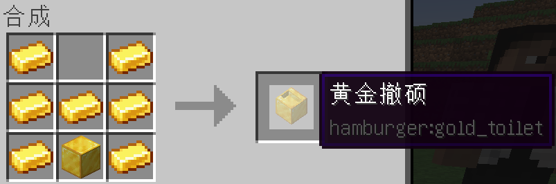
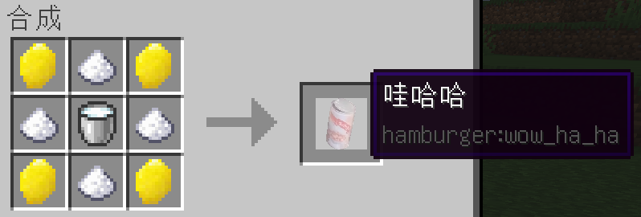

# 老八秘制小汉堡

### 介绍
**老八的MOD，你们懂的（笑**

新增实体生物：_**扒鸭、老八**_

新增流体：_**粑粑水**_

新增药水效果：_**撤硕的力量**_

新增生物群系：_**岛市生物群系**_

新增结构：_**撤硕**_

----
### 教程

#### 视频教程：待补充

1、首先，需要造出对应材料的“撤硕”。合成表：

2、在撤硕上按**shift**，即可获得粑粑（需消耗6点饥饿值）**(注意，必须反复按shift，_不是一直按着_)**。

3、粑粑可以直接吃（现实中请勿模仿），可以获得**撤硕的力量**buff（有速度、攻击力加成）。

4、粑粑可以当骨粉用。

5、主要物品的合成表：

（1）豆腐合成表：（这很不科学）

（2）臭豆腐合成表：

（3）腐乳合成表：

*盐可以通过挖掘盐矿得到，**盐矿到处都有，且储量巨大**。

（4）老干妈合成表：（同样很不科学）

（5）哇哈哈合成表：（不是打广告）

（6）小汉堡合成表：（别问我为啥没有生菜，问就是懒）

（7）睡前小甜点合成表：（别问我为啥没有韭菜花，问就是懒）

6、这些“食物”（**小汉堡/睡前小甜点**）吃了之后只会获得**反胃**，如果想要**撤硕的力量**，参见下一条。（**食用烤扒鸭不会获得反胃**）

7、当你有了这些“食物”**（包括烤扒鸭）**，你就可以找到老八（_参见第十条_），让他帮你做成附了魔的食物（_参见第十六条_），使用食物可以获得**撤硕的力量II**。

8、**扒鸭**会在**岛市生物群系**生成（因为缺少声音素材，使用的是鸡的声音），杀死扒鸭后会掉落生扒鸭，可以放进熔炉里烤。扒鸭会掉落**扒鸭蛋**，与鸡蛋类似。

9、吃完附魔的“食物”后，会获得相应的成就，当这三种食物都吃过之后，会获得另一个成就与100点经验。

10.1、**岛市生物群系**会生成结构：**撤硕**，**老八**可以在撤硕里找到。

10.2、**岛市生物群系**还会生成**粑粑水湖**，里面是**粑粑水**，粑粑水可用于灌溉农田。

10.3、**粑粑水**仅在**岛市生物群系**生成。

11、用**粑粑**右键**泥土/草方块/耕地**，可以使其变成**肥沃泥土/草方块/耕地**。**肥沃耕地**可以使上面的农作物加快生长，使用**粑粑水**灌溉还可以更快生长。

12、新增了**柠檬树**，会在**草原生物群系、岛市生物群系**生成。打掉柠檬树的**叶子**可以掉落柠檬，可以制成柠檬种子。

13、没有柠檬树苗，只要拿着**柠檬种子**在地上右键，就可以放置一个柠檬树苗。

14.1、将**粑粑**扔给**老八**，将会被捡起并拿在右手上。将**小汉堡/睡前小甜点/烤扒鸭**扔给**老八**，将会被捡起并拿在左手上。当左右手同时持有物品时，他就会开始施法。此时会播放相应的声音，肩上会出现***深色*粒子效果**。

14.2、为防止玩家误将物品扔给老八，每过**5秒**，老八便会扔出身上全部物品（**施法时不会**）。因此，请在**5秒内**将相应物品扔给老八。

14.3、老八一次只能施法一个物品，施法后将会连带已施法和未施法的物品一起扔出，**60秒内**不会再捡起物品，此时会散发***浅色*粒子**，此时退出世界再次进入，**粒子会不再散发，_但CD还在_**（这是原版客户端与服务端同步的特性，我们无能为力）。

15、待补充。
